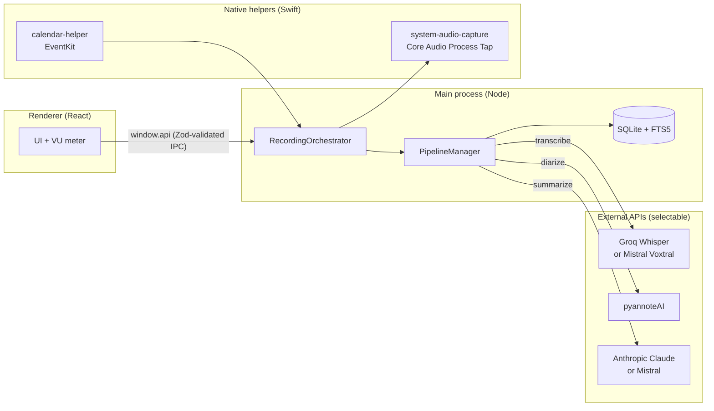

# Muesli

**A private, on-device meeting assistant for macOS**: records your meetings, transcribes them, identifies who said what, and writes a structured summary, without sending audio to any meeting platform or recording bot.

Muesli runs entirely as a local desktop app. Both the transcription and the summarization steps are **provider-agnostic**: you choose your models in Settings: Groq Whisper or **Mistral Voxtral** for speech-to-text, Anthropic Claude or **Mistral** for summaries. The only data that leaves your machine are the audio chunks sent to the APIs you configure (Groq, pyannoteAI, Anthropic, Mistral). There is no Muesli backend, no account, and no telemetry.

> 🇫🇷 _Version française plus bas, [aller à la section française](#muesli-fr)._

[](https://github.com/oscar-slg-8/muesli/actions/workflows/ci.yml)
-black>)


---

## Why it exists

Most meeting-notes tools join the call as a visible bot or upload everything to a SaaS backend. Muesli takes the opposite approach: it captures the microphone and system audio **locally** on macOS, so it works on any call (Meet, Zoom, Teams, a phone on speaker) and nothing is stored on a third-party server you don't control.

It is also far cheaper. There is no subscription: instead of a flat monthly plan like Granola (~$18/user/month), you pay only for what you actually use through your own API keys, which typically works out to a few cents per meeting. For occasional use, that is a fraction of the cost of a fixed plan.

## Features

- **Local dual-stream capture**: microphone and system audio are recorded separately (stereo `chunk_NNN.wav`, L = you, R = the room) using the macOS 14.2+ Core Audio Process Tap, with an `ffmpeg`/BlackHole fallback.
- **Transcription**: selectable provider: Groq Whisper (`whisper-large-v3`) or **Mistral Voxtral** (`voxtral-mini`), chunked with voice-activity detection and loudness normalization to handle 90-minute meetings.
- **Speaker diarization**: pyannoteAI assigns each segment to a speaker, then segments are re-transcribed per speaker and merged into a clean, attributed transcript.
- **Summarization**: selectable provider: Anthropic Claude (`claude-haiku-4-5-20251001`) or **Mistral** (`mistral-small-latest`) produces a structured summary; summary prompts are user-editable templates.
- **Full-text search**: every transcript is indexed with SQLite FTS5.
- **Calendar integration**: reads upcoming macOS Calendar events (EventKit) and pre-creates meetings with the right title and join link.
- **Export**: push notes to Notion.
- **Usage-based pricing**: no subscription. You pay only for the API calls you make (a few cents per meeting), a fraction of the cost of a flat plan like Granola.
- **Private by design**: API keys are encrypted at rest with the macOS Keychain (`safeStorage`); no audio is persisted off-device.

## Architecture

Electron with a strict process split: the **main process** owns all I/O (audio, database, network, native helpers); the **renderer** (React) talks to it only through a whitelisted `window.api` bridge. Every IPC call is validated with a Zod schema before it runs.



### Pluggable model providers

Transcription and summarization are each abstracted behind a small provider layer, so the underlying model is a runtime choice rather than a hardcoded dependency:

| Stage          | Providers                                                                | Where to switch          |
| -------------- | ------------------------------------------------------------------------ | ------------------------ |
| Speech-to-text | **Groq** Whisper `whisper-large-v3` · **Mistral** Voxtral `voxtral-mini` | Settings → Transcription |
| Summarization  | **Anthropic** Claude `claude-haiku-4-5` · **Mistral** `mistral-small`    | Settings → Résumé IA     |

Each provider is a single configurable client (`src/services/transcription.ts`, `src/services/summarization.ts`) selected by the `transcriptionProvider` / `summaryProvider` settings, so adding a new model is a matter of extending the provider map, with no pipeline changes required.

**Transcription pipeline** (`electron/recording/PipelineManager.ts`):

```
extract mono → VAD → normalize → Groq Whisper
  → pyannote diarize → per-speaker re-transcribe → merge
  → Claude summarize → persist
```

Meeting lifecycle: `draft → recording → transcribing → summarizing → complete | error`. On startup, any meeting left mid-pipeline by a crash is automatically recovered and re-run.

A detailed design document (in French) lives in [`ARCHITECTURE.md`](ARCHITECTURE.md).

### AI in production: the engineering that matters

The interesting part of Muesli is not calling three model APIs; it's making that pipeline reliable enough to trust with a 90-minute meeting:

- **Resilient network calls.** `AbortSignal.timeout()` is unreliable in the Electron main process (its backing timer can fail to fire while the event loop is busy with network I/O), so all API calls use a manual `AbortController` + `setTimeout` `fetchWithTimeout()` wrapper, consistently across the Groq, pyannote, and Anthropic clients.
- **Long-running jobs.** Diarization is an async polling job with exponential backoff and a 30-minute ceiling; transcription is chunked so a single failure doesn't lose the whole meeting.
- **Crash recovery.** In-flight meetings are reconciled and re-processed on the next launch.
- **Defense in depth.** All IPC is Zod-validated at the process boundary; credentials are encrypted with the OS keychain; the renderer runs with `contextIsolation` and no Node integration.

## Tech stack

| Layer          | Choice                                                                                        |
| -------------- | --------------------------------------------------------------------------------------------- |
| Shell          | Electron 32 (Node 20 / Chromium)                                                              |
| UI             | React 18 + TypeScript + Tailwind CSS                                                          |
| Storage        | better-sqlite3 with FTS5                                                                      |
| Validation     | Zod (all IPC)                                                                                 |
| Speech-to-text | Groq Whisper `whisper-large-v3` _or_ Mistral Voxtral (selectable)                             |
| Diarization    | pyannoteAI                                                                                    |
| Summarization  | Anthropic Claude `claude-haiku-4-5-20251001` _or_ Mistral `mistral-small-latest` (selectable) |
| Native helpers | Swift (Core Audio Process Tap, EventKit)                                                      |
| Tooling        | electron-vite, ESLint, Prettier, GitHub Actions                                               |

## Getting started

**Requirements:** macOS 14.2+ on Apple Silicon · Node.js 22 LTS.

```bash
brew install node@22
brew install blackhole-2ch switchaudio-osx   # system-audio fallback + auto device switching

npm install        # postinstall patches the Electron app bundle
npm run rebuild     # rebuild better-sqlite3 for the Electron ABI
npm run dev
```

Add your API keys in **Settings** (stored encrypted in the macOS Keychain):

- **Groq**: transcription, free tier available · [console.groq.com](https://console.groq.com)
- **pyannoteAI**: speaker diarization · [pyannote.ai](https://www.pyannote.ai)
- **Anthropic**: summaries, ~$0.01/meeting · [console.anthropic.com](https://console.anthropic.com)
- **Mistral** _(optional)_: alternative transcription (Voxtral) and summary (Mistral Small) provider, selectable in Settings · [console.mistral.ai](https://console.mistral.ai)

### Development

```bash
npm run lint          # ESLint
npm run format:check  # Prettier
npm run typecheck     # tsc --noEmit
npm run build         # electron-vite build
```

These four checks are the CI gate (`.github/workflows/ci.yml`). See [`CONTRIBUTING.md`](CONTRIBUTING.md) for details.

<!-- Screenshots: add app screenshots to a docs/ folder and reference them here. -->

---

<a name="muesli-fr"></a>

## 🇫🇷 Muesli (français)

**Un assistant de réunion privé et local pour macOS** : enregistre vos réunions, les transcrit, identifie qui a parlé, et rédige un résumé structuré, sans bot visible et sans backend distant.

Muesli est une application de bureau **100 % locale** : aucun compte, aucune télémétrie, aucun serveur Muesli. La transcription et le résumé sont **indépendants du fournisseur** : vous choisissez vos modèles dans les Réglages : Groq Whisper ou **Mistral Voxtral** pour la transcription, Anthropic Claude ou **Mistral** pour le résumé. Les seules données qui quittent votre machine sont les extraits audio envoyés aux API que vous configurez (Groq, pyannoteAI, Anthropic, Mistral).

C'est aussi bien moins cher. Pas d'abonnement : au lieu d'un forfait mensuel fixe comme Granola (~18 $/utilisateur/mois), vous ne payez qu'à l'usage via vos propres clés API, soit quelques centimes par réunion. Pour un usage occasionnel, c'est une fraction du prix d'un forfait.

### Fonctionnalités

- **Capture double flux locale** : micro et audio système enregistrés séparément (`chunk_NNN.wav` stéréo : G = vous, D = la salle) via le _Process Tap_ Core Audio (macOS 14.2+), avec repli `ffmpeg`/BlackHole.
- **Transcription** : fournisseur au choix : Groq Whisper (`whisper-large-v3`) ou **Mistral Voxtral** (`voxtral-mini`), découpée avec détection d'activité vocale et normalisation pour gérer des réunions de 90 minutes.
- **Diarisation** : pyannoteAI attribue chaque segment à un locuteur, puis re-transcription par locuteur et fusion en une transcription attribuée.
- **Résumé** : fournisseur au choix : Claude (`claude-haiku-4-5-20251001`) ou **Mistral** (`mistral-small-latest`), avec des modèles de prompt modifiables.
- **Recherche plein texte** : chaque transcription est indexée avec SQLite FTS5.
- **Calendrier** : lecture des événements macOS (EventKit) et pré-création des réunions.
- **Export Notion**.
- **Tarification à l'usage** : pas d'abonnement. Vous ne payez que les appels API que vous faites (quelques centimes par réunion), soit une fraction du prix d'un forfait fixe comme Granola.
- **Privé par conception** : clés API chiffrées via le Trousseau macOS (`safeStorage`).

### Architecture

Séparation stricte des processus Electron : le **processus principal** gère toutes les I/O (audio, base de données, réseau, binaires natifs) ; le **renderer** (React) ne communique qu'à travers un pont `window.api` filtré, et chaque appel IPC est validé par un schéma Zod. Pipeline :

```
mono → VAD → normalisation → Groq Whisper
  → diarisation pyannote → re-transcription par locuteur → fusion
  → résumé Claude → persistance
```

Le détail de conception se trouve dans [`ARCHITECTURE.md`](ARCHITECTURE.md).

### Installation

**Prérequis :** macOS 14.2+ sur Apple Silicon · Node.js 22 LTS.

```bash
brew install node@22
brew install blackhole-2ch switchaudio-osx
npm install
npm run rebuild
npm run dev
```

Renseignez vos clés API dans **Réglages** (chiffrées dans le Trousseau macOS) : Groq (transcription), pyannoteAI (diarisation), Anthropic (résumés). **Mistral** est proposé en option (Voxtral pour la transcription, Mistral Small pour le résumé), sélectionnable dans les Réglages.

---

## License

[MIT](LICENSE) © Oscar Salmon-Legagneur
